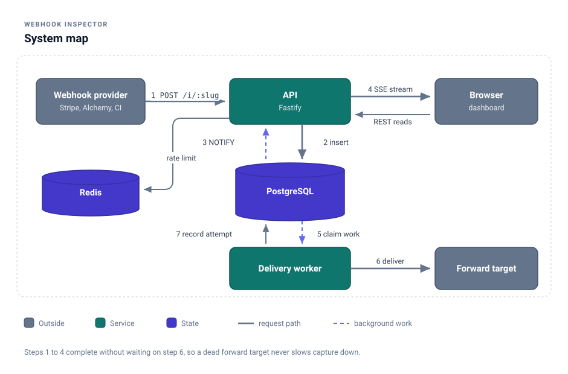
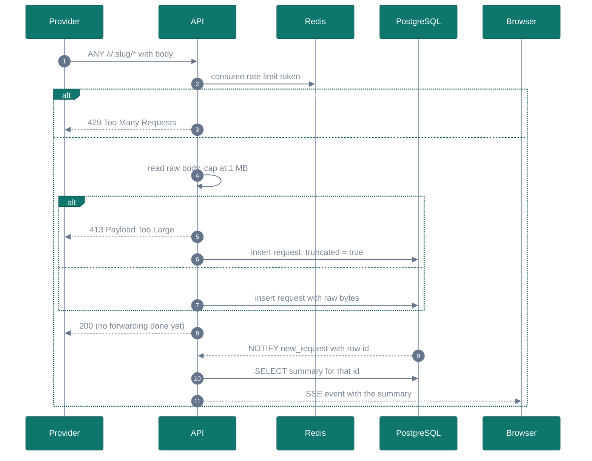
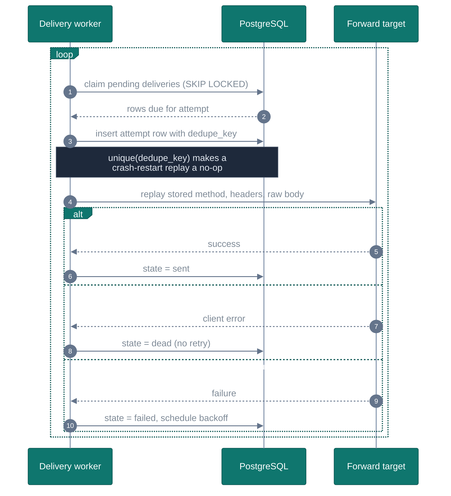
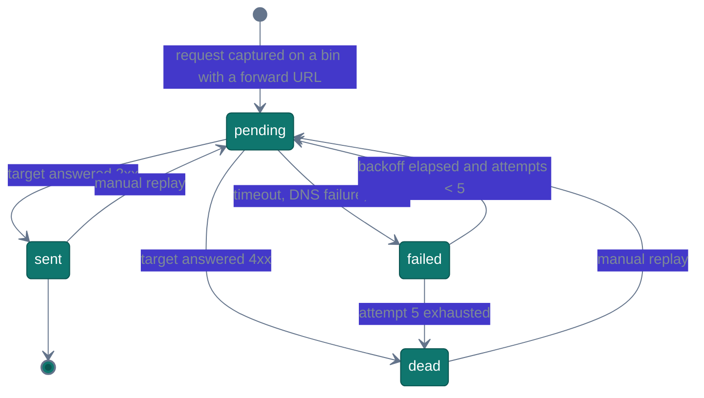
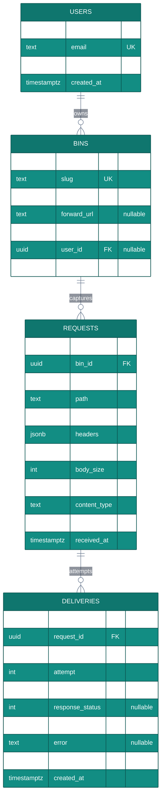
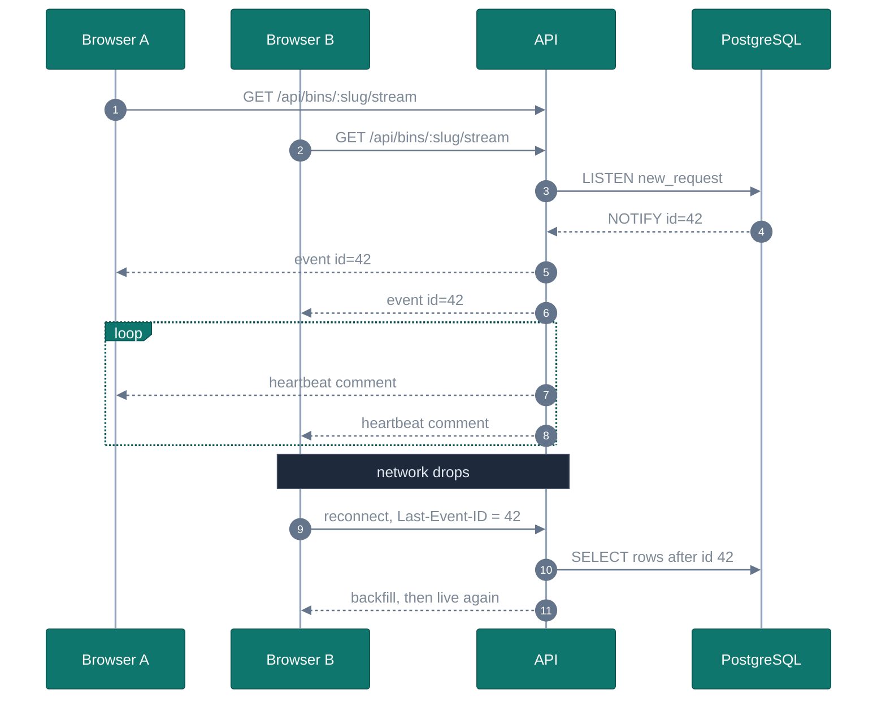
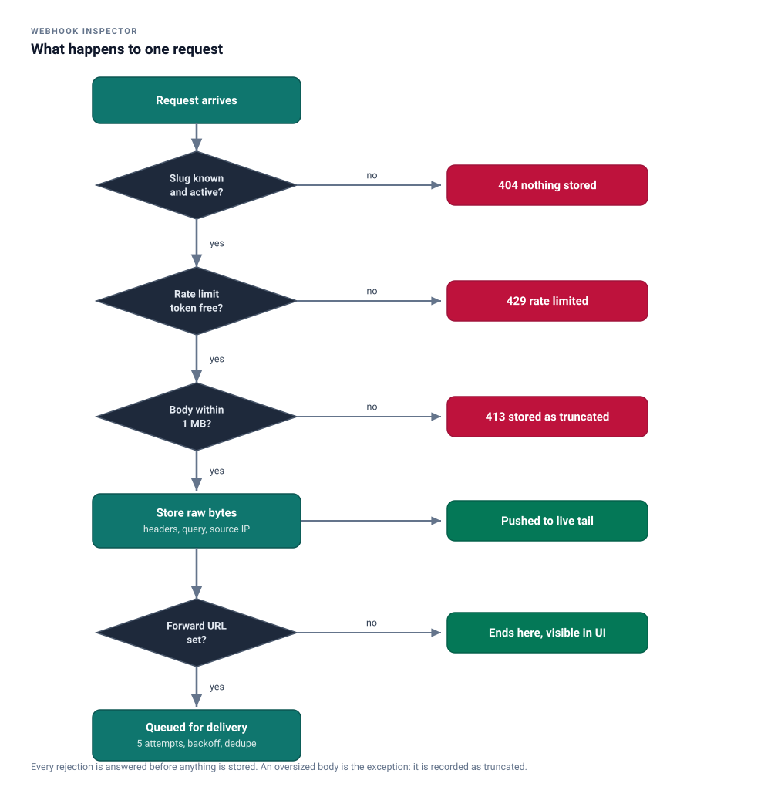
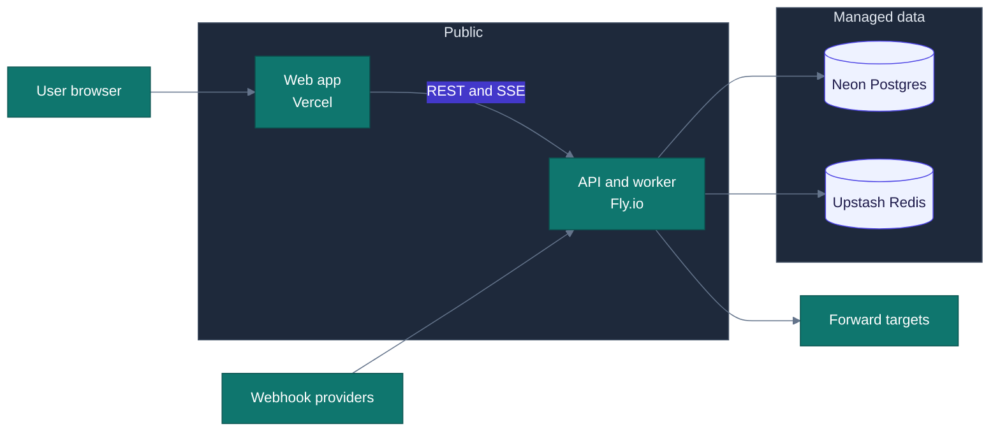

# Architecture

Eight diagrams, in the order they build on each other: the system map first,
then the two paths a request can take through it, then the state machine that
keeps delivery safe, then the shape of what gets stored.

The two overview diagrams are checked-in SVGs with a light and a dark variant,
generated by `docs/diagrams/render.py`. Edit that script and re-run it rather
than editing the SVGs by hand. The remaining diagrams are mermaid and render
inline on GitHub.

---

## 1. System map

<picture>
  <source media="(prefers-color-scheme: dark)" srcset="img/system-map-dark.svg">
  
</picture>

The load-bearing rule is that steps 1 to 4 finish without waiting on step 6. A
slow or unreachable forward target must never slow down capture, so the worker
reads its work from the database rather than from the request that created it.

---

## 2. Capture path

What happens between a provider sending a request and it appearing on screen.

The 200 is sent before any delivery work exists. Everything after it is the
service's problem, not the provider's.

---

## 3. Delivery path

Delivery is a separate loop with its own failure handling.

A 4xx is the target saying the payload is wrong. Retrying it only wastes
attempts, so it is terminal. A 5xx or a timeout is the target saying "not
now", which is worth retrying.

---

## 4. Delivery state machine

Backoff is exponential with jitter: roughly 1s, 4s, 15s, 60s, 300s, each
shifted by a random fraction so a batch of failures does not retry in lockstep.

---

## 5. Data model

`requests` is indexed on `(bin_id, received_at DESC, id DESC)`, which is the
exact order the list endpoint pages through, so the query is an index scan
rather than a sort.

---

## 6. Live tail

Two clients on the same bin, and one of them reconnecting.

Two details carry this: the heartbeat keeps proxies from closing an idle
stream, and `Last-Event-ID` lets a reconnecting client backfill instead of
silently missing whatever arrived while it was gone.

---

## 7. Request lifecycle at a glance

<picture>
  <source media="(prefers-color-scheme: dark)" srcset="img/lifecycle-dark.svg">
  
</picture>

---

## 8. Deployment

The API process and the delivery worker run in the same deployment but as
separate process types, so the worker can be scaled or restarted without
interrupting capture.
